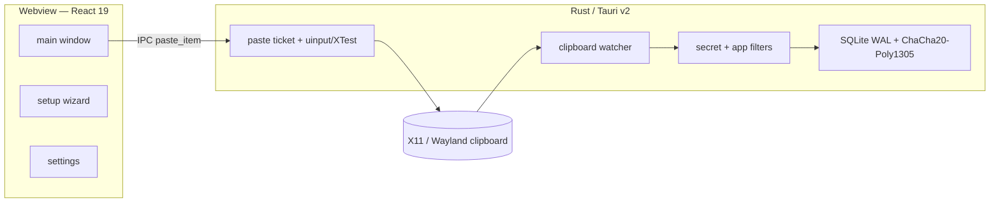

# Architecture / معماری

> **English** below the Persian section. / بخش انگلیسی پایین‌تر است.

<div dir="rtl">

## نمای کلی

برنامه یک مدیر تاریخچه کلیپ‌بورد دسکتاپ است که تجربهٔ Win+V ویندوز ۱۱ را روی لینوکس (Wayland و X11) بازسازی می‌کند.

```
┌──────────── Webview (React 19) ────────────┐
│  main / setup / settings                   │
│  CSP: script-src 'self'                    │
└─────────────── IPC (Tauri) ────────────────┘
                    │
┌──────────── Rust core ─────────────────────┐
│  Watcher → Privacy → SQLite (encrypted)    │
│  Paste ticket → uinput / XTest             │
│  SSRF + DNS pin (Tenor, optional)          │
└────────────────────────────────────────────┘
```

## مرزهای اعتماد

1. **کلیپ‌بورد → persistence:** محتوای هر برنامه وارد تاریخچه می‌شود؛ فیلتر اسرار و skip مدیر رمز عبور جلوی آن را می‌گیرند.
2. **Webview → Rust:** فقط فرمان‌های ثبت‌شده؛ `withGlobalTauri: false`.
3. **Rust → سیستم:** `/dev/uinput` و `pkexec`؛ بلیت paste و گیت `wrote_recently`.
4. **Rust → شبکه:** فقط دانلود GIF با allowlist + DNS pinning.

جزئیات تهدید در [`THREAT_MODEL.md`](THREAT_MODEL.md).

</div>

---

## Overview

The app recreates the Windows 11 Win+V clipboard history on Linux (Wayland and X11).



## Layers

| Layer | Stack | Role |
| --- | --- | --- |
| UI | React 19, TypeScript strict, Tailwind 4 | Three windows; lazy pickers; virtualized list |
| Backend | Rust, Tauri v2 | Domain modules, typed `AppError` |
| Clipboard I/O | arboard + `wl-copy` / `xclip` | Read/write with fallback |
| Persistence | SQLite WAL, field encryption, PNG thumbs | Cap 2000 items |
| Input | Persistent uinput / XTest | Ctrl+V after an authorized write |
| Packaging | deb / rpm / AppImage / AUR / Flatpak | Multi-distro |

## Paste authorization

1. Write the payload to the OS clipboard.
2. Issue a one-shot paste ticket (5 s TTL).
3. Consume the ticket and require `wrote_recently(5s)`.
4. Hide the popup, restore the previous focus (X11), inject Ctrl+V.

## Related ADRs

- [0001 SQLite persistence](adr/0001-sqlite-persistence.md)
- [0002 Paste injection](adr/0002-paste-injection-architecture.md)
- [0003 SSRF DNS pinning](adr/0003-ssrf-dns-pinning.md)
- [0004 Field encryption](adr/0004-field-encryption.md)
- [0005 CI & supply chain](adr/0005-ci-supply-chain.md)
